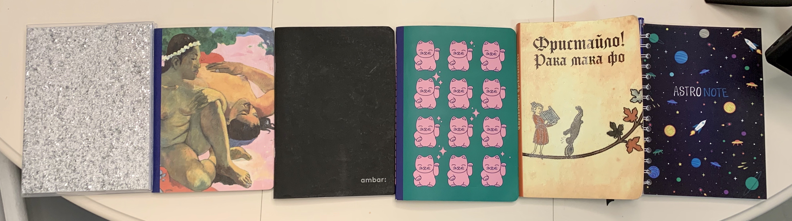

В январе этого года я начал вести дневник. И это стала вторая практика после медитации, которая прижилась у меня как ежедневная привычка. (йей!)

В этом дневнике нет никакой структуры или заданных вопросов. Проснувшись, я открываю дневник и в свободной форме заполняю три страницы от руки. Я стащил это упражнение из книги [“Путь художника”](https://www.goodreads.com/review/show/2693334516) Джулии Кэмерон. Такие "утренние страницы" помогают мне настроиться на день. Работает где-то посередине между терапией и медитацией, только в более непринужденном формате.

На фоточке дневники, которые я успел исписать за год. В хронологическом порядке. ☺️

Первый, с блестящим глиттером, я купил в Сан Франциско в местной версии Передвижника. (Жаль, что не взял тогда два.) Я специально выбирал визуально привлекательный дневник, чтобы меньше был барьер начать его вести, пока еще не выработалась привычка.

Второй я купил в Республике, когда увидел классную обложку. В нем были точечки внутри (и они не совпадали с моим ритмом письма поначалу) и самая приятная на ощупь бумага в моей жизни. Эта особая тактильность так мне понравилась, что я даже немного расстроился, когда этот дневник закончился. Хотя обычно я радуюсь, когда что-то доделал.

Третий — это обычная школьная тетрадь из Лиссабона. Я купил ее во время поездки туда на новогодние праздники в прошлом году. Мне срочно захотелось порисовать, и я пошел искать блокнот в пустынном городе после рождества. В итоге открыт был только киоск с лотерейными билетами, где седые мужчины увлеченно вычеркивали квадратики на своих листочках. На мою удачу кроме лотерейных билетов там еще оказались и тетради. На выбор было две: с героями мультика Тачки (от ее аляповатости во мне что-то умерло внутри) и черная (ее я купил).

Четвертый мне подарила подруга. Я тогда только приехал из Китая с випассаны. А там на каждой двери висели картонные розовые хрюшки в честь года земляной свиньи. Прям реально на каждой двери висели. Поэтому первое время из-за розового цвета я думал, что на дневнике тоже хрюшки. И только через несколько дней заметил, что это вообще-то котики. 😅

Пятый я увидел во [Friends & Function](https://friendfunction.ru/), когда шопился подарками на Burning Man. Я увидел обложку и вспомнил майскую поездку с ребятами на Волгу. В поездке мы жарили сосиски на костре, стреляли из лука из тачки на ходу и строили тарзанку. Я там снял стори, как съезжаю на тарзанке и одновременно играю на укулеле. До сих пор вспоминаю это как лучший момент года. Сторис из той поездки я постил с хэштегом #ракамакафо, так что увидев такую же надпись на дневнике, я купил его не раздумывая.

А последний, шестой, я веду прямо сейчас. Его подарил мне Тёма, ведущий [нашего подкаста](https://hugo-nebula.transistor.fm/) про научную фантастику. Я валялся тогда в больнице со сломанной рукой и очень грустил. А Тема привез мне блокнот про космос, и это было супер мило. Так что писать в этом дневнике мне особенно приятно. Где-то к новому году и его закончу. 🚀

Я надеюсь, что привычка с дневником переедет в 2020. Потому что в аэропорту Амстердама я себе прикупил следующий блокнот с принтом ковра и золотыми страницами. А такое золото упускать нельзя.
